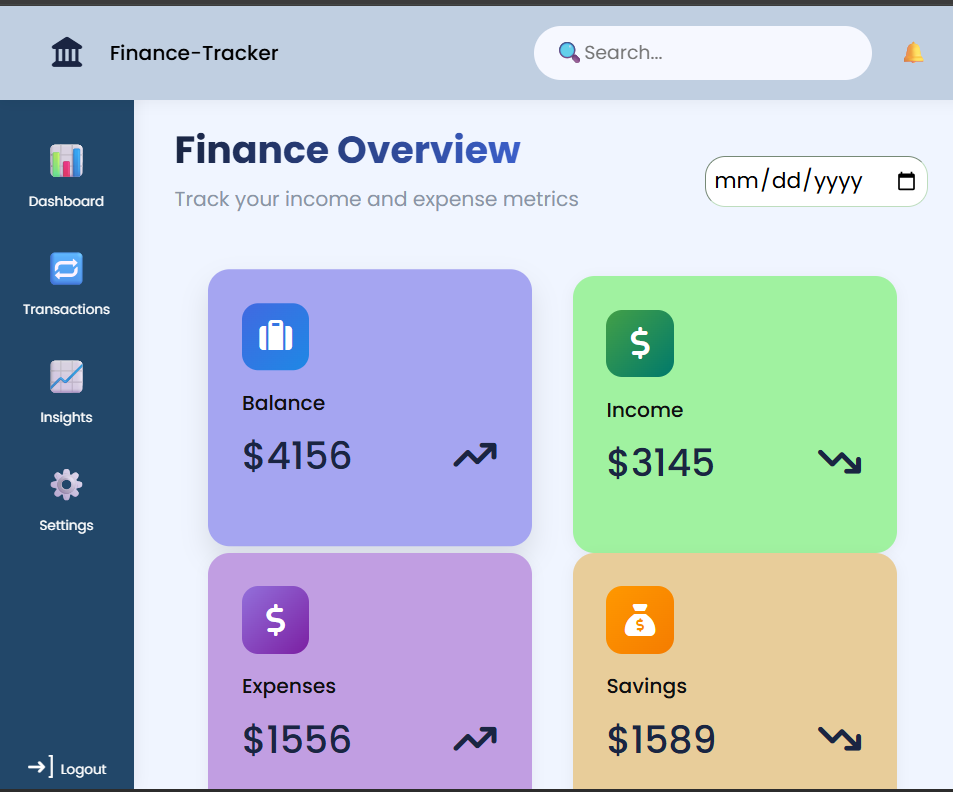

# Finance Dashboard UI

A clean and interactive Finance Dashboard UI built to help users track income, expenses, and financial insights.  
This project was developed as part of a Frontend Developer Internship assessment to demonstrate frontend development skills including UI design, state management, data visualization, and component-based architecture.

---

## Overview

The Finance Dashboard allows users to:
- View overall financial summary (Balance, Income, Expenses)
- Analyze spending trends over time
- View category-wise expense breakdown
- Explore and filter transactions
- Switch between Admin and Viewer roles
- View financial insights such as highest spending category and monthly comparison

This project focuses on **frontend architecture, UI/UX design, and state management**, not backend development.

---

## Features

### Dashboard
- Total Balance card
- Total Income card
- Total Expenses card
- Time-based chart (Balance trend)
- Category-based chart (Expense breakdown)

### Transactions
- Transactions table with:
  - Date
  - Amount
  - Category
  - Type (Income / Expense)
- Search transactions
- Filter by type
- Sort by date/amount

### Role-Based UI
- Viewer → Can only view data
- Admin → Can add/edit/delete transactions

### Insights
- Highest spending category
- Monthly income vs expense comparison
- Financial observations

### Additional Features
- Responsive design (Mobile + Desktop)
- LocalStorage data persistence
- Empty state handling
- Clean and modern UI

---

## Tech Stack

- HTML & CSS
- BOOTSTRAP, CHARTJS
- JAVASCRIPT
- Python(Django)

---

## Project Structure
FINANCE_TRAKER/
|--finance_dashboard/
||--static/
|||--css/
|||--js/
|
|--data/
|
|--templates


---

## State Management Approach

The application uses centralized state management to manage:
- Transactions data
- Filters and search
- Selected user role (Admin / Viewer)

This ensures:
- Clean separation between UI and logic
- Reusable components
- Easier state updates and data flow

---

## Data Handling

The dashboard works with mock transaction data and performs:
- Balance calculation
- Income/Expense calculation
- Category aggregation
- Monthly trend analysis
- Filtering and sorting logic

---

## UI/UX Considerations

- Clean and readable layout
- Responsive design for different screen sizes
- Color coding:
  - Income → Green
  - Expense → Red
- Handles edge cases:
  - No transactions
  - No search results
  - Empty charts
  - Viewer role restrictions

---

## Setup Instructions

### 1. Clone the repository
```bash
git clone https://github.com/vishnuvardhan1705/Finance-Tracker.git
'''

## Screenshots

### Dashboard




### Transactions


