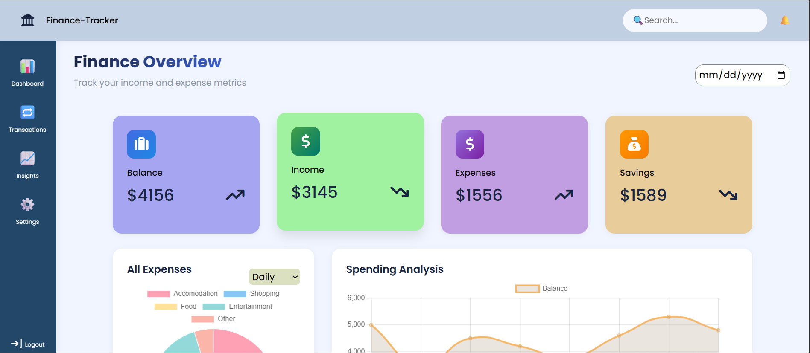
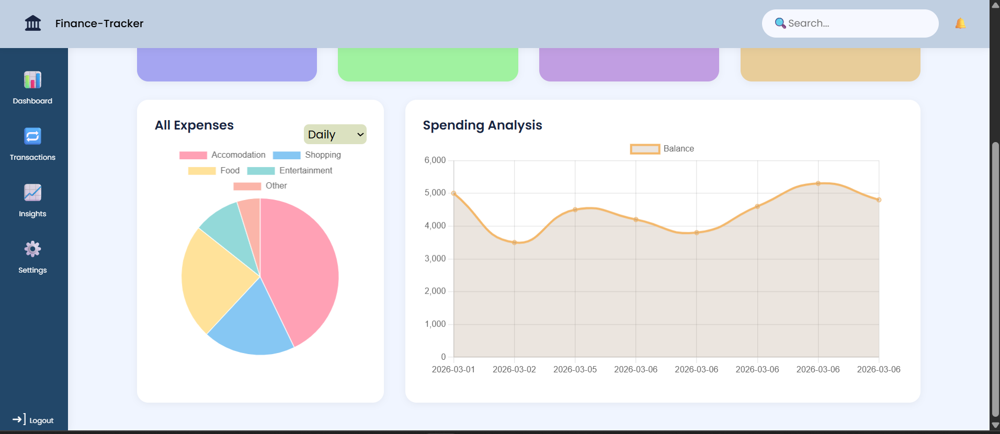
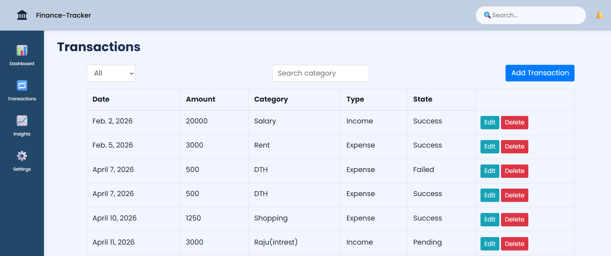
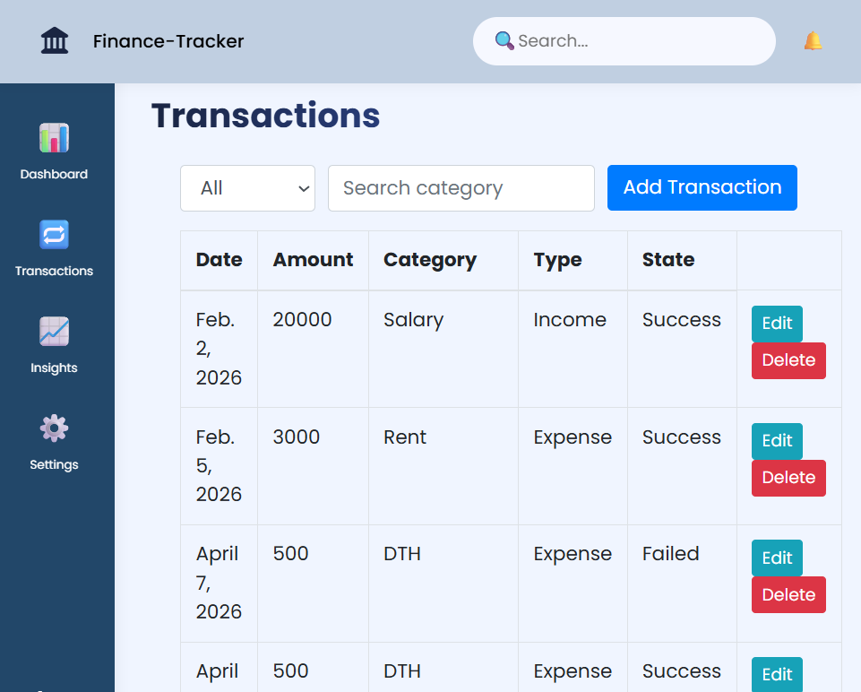
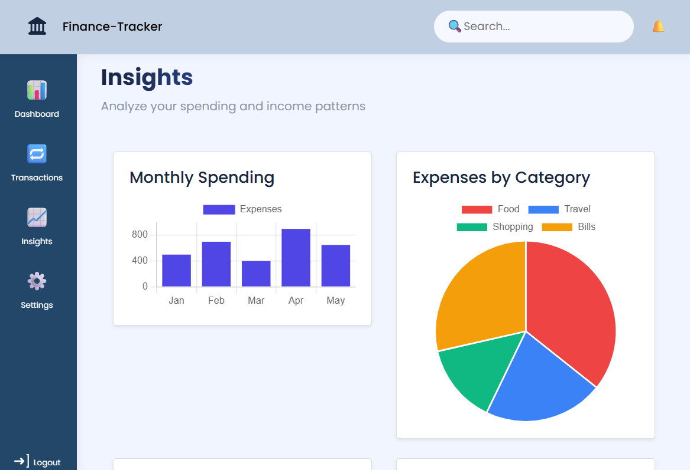
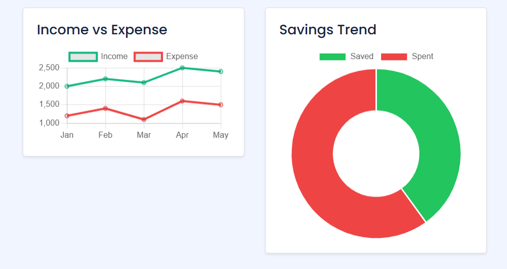

# Finance Dashboard UI

A clean and interactive Finance Dashboard UI built to help users track income, expenses, and financial insights.  
This project was developed as part of a Frontend Developer Internship assessment to demonstrate frontend development skills including UI design, state management, data visualization, and component-based architecture.

---

## Overview

The Finance Dashboard allows users to:
- View overall financial summary (Balance, Income, Expenses)
- Analyze spending trends over time
- View category-wise expense breakdown
- Explore and filter transactions
- View financial insights such as highest spending category and monthly comparison

---

## Features

### Dashboard
- Total Balance card
- Total Income card
- Total Expenses card
- Time-based chart (Balance trend)
- Category-based chart (Expense breakdown)

### Transactions
- Transactions table with:
  - Date
  - Amount
  - Category
  - Type (Income / Expense)
  - State (Success/Failed)
- Search transactions

### Insights
- Savings
- Monthly income vs expense comparison
- Expense by Category

### Additional Features
- Responsive design (Mobile + Desktop)
- Empty state handling
- Clean and modern UI

---

## Tech Stack

- HTML & CSS
- BOOTSTRAP, CHARTJS
- JAVASCRIPT
- Python(Django)

---

## State Management Approach

The application uses centralized state management to manage:
- Transactions data
- Filters and search

This ensures:
- Clean separation between UI and logic
- Reusable components
- Easier state updates and data flow

---

## Data Handling

The dashboard works with mock transaction data and performs:
- Balance calculation
- Income/Expense calculation
- Category aggregation
- Monthly trend analysis
- Filtering and sorting logic

---

## UI/UX Considerations

- Clean and readable layout
- Responsive design for different screen sizes
- Handles edge cases:
  - No transactions
  - No search results
  - Empty charts

---
## Screenshots

### Dashboard

### Transactions

### Insights

## Demo Video
Watch the demo here
https://1drv.ms/v/c/2d721db33fcdc856/IQACuEsRMWAERpOadjrXz0_-AYnqtZ2pWDJozKl5bns1aaI?e=24juwc
